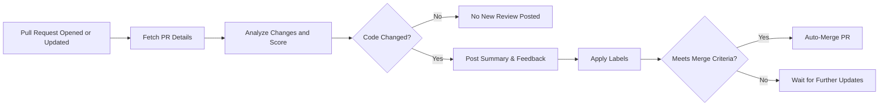

# AI Pull Request Review Agent

This repository is equipped with an automated agent that continually monitors open pull requests. When a pull request is opened or updated, this agent:

1. **Fetches** the latest changes from the pull request.  
2. **Analyzes** the code to detect potential security concerns, code quality issues, and overall impact on the codebase.  
3. **Posts a comment** summarizing its findings (e.g., changes introduced, potential vulnerabilities, and recommended actions).  
4. **Applies labels** (e.g., “needs-review” or “needs-changes”) and may **automatically merge** if the pull request meets certain quality thresholds and is mergeable.

This AI reviewer aims to streamline collaboration by providing consistent, near-real-time feedback on proposed changes. It helps highlight areas of improvement, reduce human error, and accelerate the merge process when the code meets quality standards.

> **Note:** While this agent can assist with code reviews, it is not a substitute for manual inspections or best security practices. Human oversight is advised, especially for mission-critical or security-sensitive changes.

---

### High-Level Process Overview

---

### Getting Involved

- **Open a Pull Request**: The agent will detect new pull requests and begin its review process shortly after creation.  
- **Read Review Comments**: The AI leaves comments on each open pull request with a summary of its analysis.  
- **Address Feedback**: If the agent detects issues or concerns, you can commit further changes and push them to the same branch to prompt a fresh review.

---

### Disclaimer

This automated process is intended to assist contributors and maintainers by providing high-level feedback and code suggestions. The maintainers of this repository may override any of the agent’s automated decisions. No guarantee is made about completeness, correctness, or advisability of the AI-generated feedback. Manual reviews by humans remain a crucial part of any responsible development workflow.